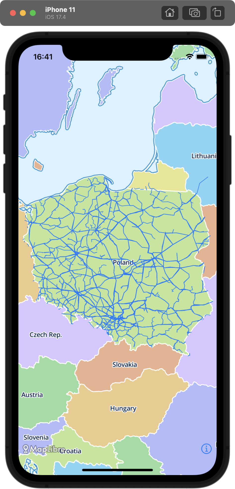
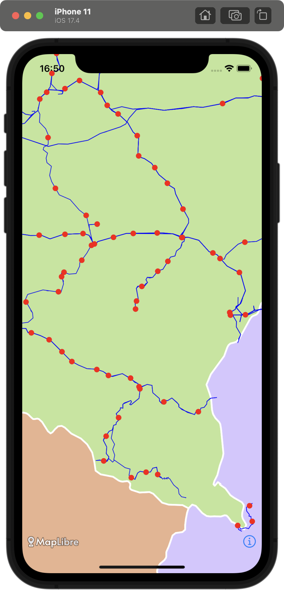
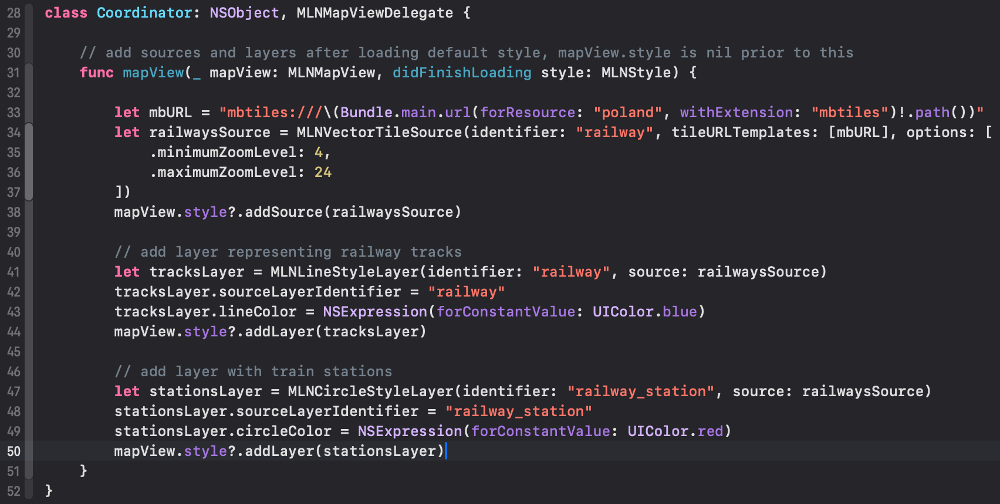

# MapLibre-samples
iOS samples for MapLibre native lib.

MapLibre-mbtiles uses SwiftUI and MapLibre Native. 
Railway tracks and stations on the map are draws using .mbtiles created by tilemaker.

&nbsp;

MLNMapView coordinator loads mbtiles source and layers once default map style is initialised.

